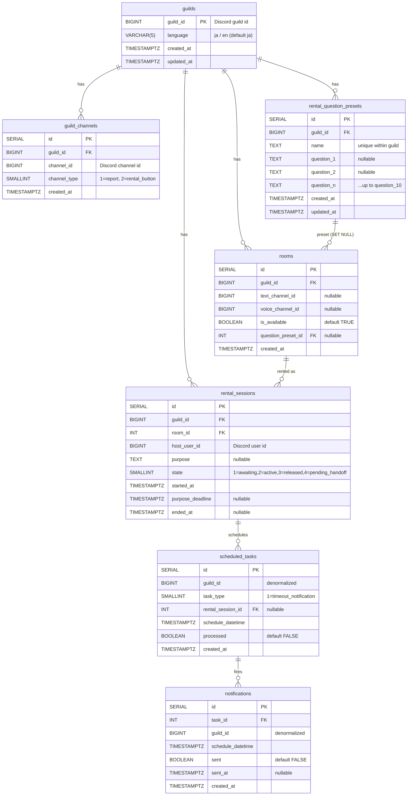

# ER Diagram

This diagram shows table relationships. Discord IDs (`guild_id`, `*_channel_id`, `host_user_id`, `task_id`) are stored as `BIGINT` and contain Discord snowflake IDs directly.

## Full Diagram

## Reading the Relationships

### Guild Tree (`guild_master` Schema)

`guilds` is the root, and all child tables have `guild_id`.
`guild_channels`, `rooms`, and `rental_question_presets` use `ON DELETE CASCADE`, so deleting a guild deletes these dependent rows. `rental_sessions` has no `ON DELETE` action for `guild_id` (`NO ACTION`), assuming history will be handled separately before deleting a guild.

`rooms` -> `rental_question_presets` uses `ON DELETE SET NULL`: deleting a preset leaves the room and only removes the association.

### Sessions and Scheduler (Bridge to the `worker` Schema)

`scheduled_tasks` references `rental_sessions(id)` with `ON DELETE CASCADE`. Physically deleting a session also deletes its schedule, but operationally sessions are not physically deleted; they are updated to `state=3 (released)`.

`scheduled_tasks` and `notifications` store `guild_id` in a **denormalized** form. Because the `worker` schema does not have RLS, `guild_id` is both a logical separation key and an index key.

### Unique Constraints

| Table | UNIQUE constraint | Meaning |
|---|---|---|
| `guild_channels` | `(guild_id, channel_type)` | One channel per type per guild |
| `rooms` | `(guild_id, text_channel_id)` | The same text channel cannot be registered to two rooms |
| `rooms` | `(guild_id, voice_channel_id)` | The same VC cannot be registered to two rooms |
| `rental_question_presets` | `(guild_id, name)` | Preset names are unique within a guild |

### Optional Field Combinations

Both `text_channel_id` and `voice_channel_id` on `rooms` are nullable. This allows one table to represent three forms: text-only, VC-only, and paired text+VC.
The rule that **at least one must have a value** is enforced by application validation (`AdminRoomAtLeastOne` in `/register_room`).
