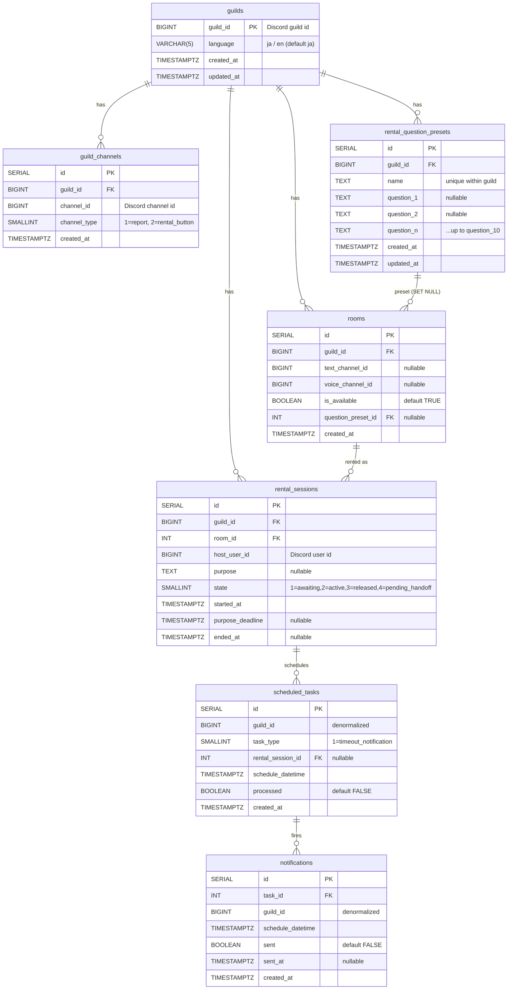

# ER図

テーブル間のリレーションを示します。Discord ID（`guild_id`、`*_channel_id`、`host_user_id`、`task_id`）はBIGINTで、Discord 側のスノーフレークIDをそのまま格納します。

## 全体図

## 関係の読み解き

### ギルドツリー（`guild_master` スキーマ）

`guilds` を頂点に、子テーブルがすべて `guild_id` を持ちます。
`ON DELETE CASCADE` を `guild_channels`／`rooms`／`rental_question_presets` に張っているため、ギルドが削除されればこれらは芋づる式に消えます。`rental_sessions` だけは `guild_id` への ON DELETE 指定がなく（NO ACTION）、ギルド削除前に履歴を別の方法で扱う想定です。

`rooms` → `rental_question_presets` は `ON DELETE SET NULL`：プリセットを消しても部屋は残り、紐付け情報だけ外れます。

### セッションとスケジューラ（`worker` スキーマへの橋渡し）

`scheduled_tasks` は `rental_sessions(id)` に `ON DELETE CASCADE` で参照しています。セッションを物理削除するとスケジュールも自動消去されますが、運用上はセッションを物理削除せず `state=3 (released)` に更新する設計です。

`scheduled_tasks` と `notifications` は `guild_id` を**非正規化**で持ちます。`worker` スキーマには RLS が掛かっていないため、 `guild_id` は分離のための論理キー兼インデックス用途です。

### 一意性制約

| テーブル | UNIQUE 制約 | 意味 |
|---|---|---|
| `guild_channels` | `(guild_id, channel_type)` | 1ギルドにつき1種別1チャンネル |
| `rooms` | `(guild_id, text_channel_id)` | 同じテキストCHを2部屋に登録できない |
| `rooms` | `(guild_id, voice_channel_id)` | 同じVCを2部屋に登録できない |
| `rental_question_presets` | `(guild_id, name)` | プリセット名はギルド内一意 |

### 任意フィールドの組み合わせ

`rooms` は `text_channel_id` と `voice_channel_id` のいずれもNULL可です。「テキストのみ」「VCのみ」「セット」の3形態を1つのテーブルで表現するため、**少なくとも一方が値を持つ**ことはアプリケーション側のバリデーション（`/register_room` の `AdminRoomAtLeastOne`）で担保しています。
